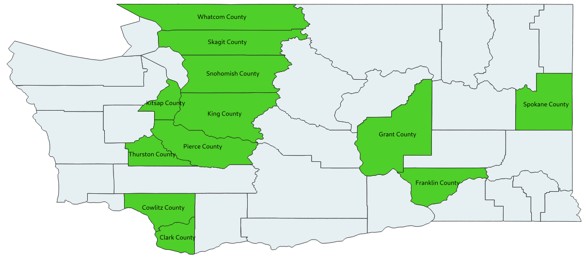

# osmand_map_creation
Osm data + open address data compiled for use in OSMAND and Maps.me
# Targets
- WA state
  - Counties
    - Clark
    - Cowlitz
    - Franklin
    - Grant
    - King
    - Kitsap
    - Pierce
    - Skagit
    - Snohomish
    - Spokane
    - Thurston
    - Whatcom
  - Cities
    - Kennewick

- ID
  - Counties
    - Ada
    - Canyon
    - Kootenai

- OR
  - Counties
    - Deschutes
    - Jackson
    - Lane
    - Marion
  - Counties OSM already has
    - Clackamas
    - Multonomah
    - Washington

# Usage
## OSMAnd
Option 1:  
Download file from releases to data folder for OSMAND and it will auto load.  
Option 2:  
Download file from releases to phone and open it. OSMAND will copy file into its data folder and load it.
This will leave a copy of the file in the Downloads folder.

Deactivate the default WA map file to ensure search pulls results from this file.  
Restart app after changes otherwise search may not work properly. Restarting is done 
by opening recent apps and flicking upward on app in Android 9.

## Maps.me
Copy files to MapsWithMe folder on phone. Move, rename or delete map files that will conflict. They are in a dated folder i.e. 191019. Restart app for changes to take effect.

# Data
## Sources
Data comes from offical sources. Urls are available from OpenAddresses in their source files or in github issues.
Osm format sources prior to merge are supplied. The merged file is not supplied since its larger Github's max file size. Run osmium sort then osmconvert --fake-version if you want to open files with josm. 
## Processing
### General
Data is preprocessed to remove bad data, then addresses are expanded and normalized to match existing OSM data.
### OSMAnd
Run osmium merge with sources and latest state extract then run OSMAnd Map Creator.
### Maps.Me
Run osmium merge with sources and latest state extract then run osmium sort then run Map_Generator using --without-coasts from release branch you want to target.
# License
ODBL 1.0
